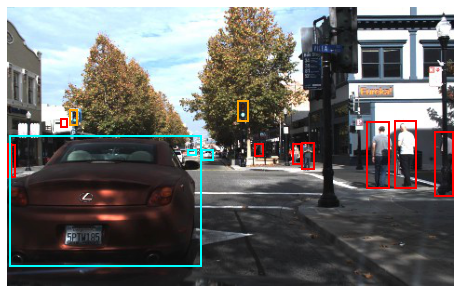

# Object Detection for Self driving Car

The task of object detection project involves drawing bounding boxes around objects and assigning labels to them.

In this project you will fine-tune a pre-trained RetinaNet model for  use on a self-driving car. In particular, we will use a subset of the Udacity self-driving car dataset.

The dataset contains 18000 training images and 4241 test images, of shape 480x300, corresponding to 132406 objects in the training set and 32699 objects in the test set. We are going to use 1/5th of the dataset in order to make the training achievable in a reasonable time frame for our class.

This is an example of an image from the dataset with the annotations:

For the detailed training process, check <b>object_detection.ipynb</b> file 